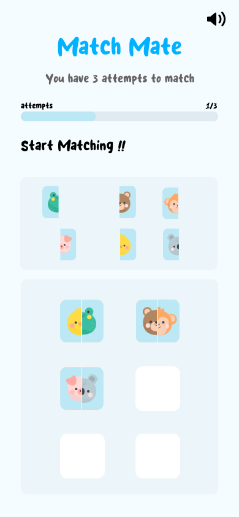
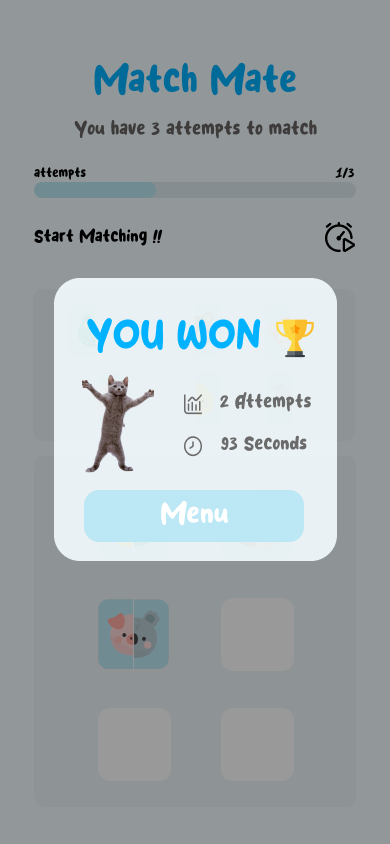
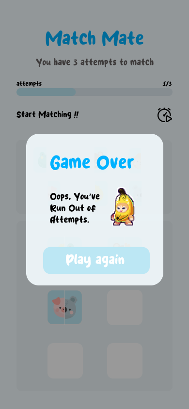
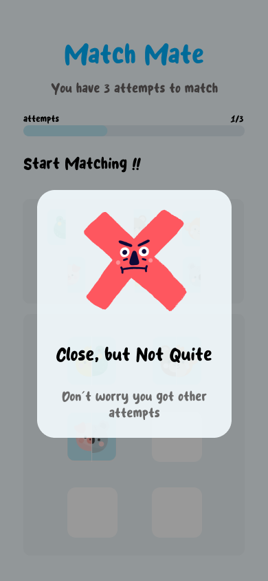
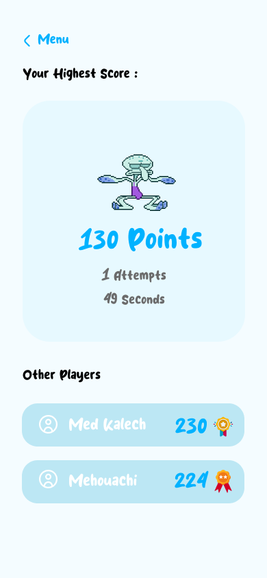
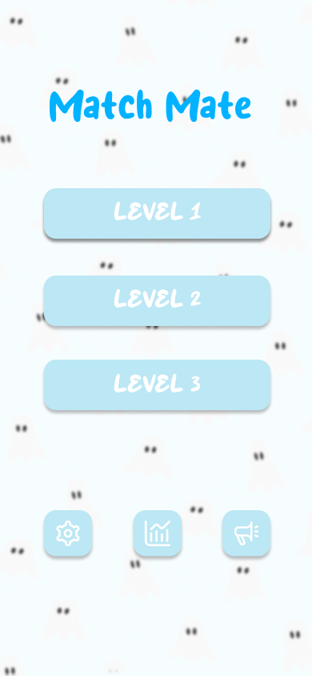

# MatchMate

[](https://github.com/apple/swift)
[](https://developer.apple.com/ios/)

**MatchMate** is an engaging memory game that challenges your recollection skills. Match pairs of cards by moving them to the right place, and aim to complete the game with the fewest moves and the fastest time.

## Screenshots

<div style="display: flex; justify-content: space-around;">





</div>

<div style="display: flex; justify-content: space-around;">





</div>

<div style="display: flex; justify-content: space-around;">



</div>

*These screenshots showcase various features of the MatchMate app.*


## Features
- Interactive memory card matching game.
- Track your fastest time and moves.
- Engaging, easy-to-understand interface.
- Real-time feedback on your performance.

## Tools & Technologies
| Tool            | Description                                   |
|-----------------|-----------------------------------------------|
| **Swift**       | Main programming language                     |
| **SwiftUI**     | User interface design                         |
| **SwiftData**   | Data persistence and management               |
| **XCTest**      | Unit testing for the app's logic              |
| **CocoaPods**   | Dependency management                         |
| **WebKit**      | Display GIFs within the app                   |
| **AVFoundation**| Audio-visual functionalities                  |
| **SwiftLint**   | Linter to enforce Swift style and conventions |

## Installation
1. Clone the repository:
    ```bash
    git clone https://github.com/KalechMed/MatchMate.git
    ```
2. Navigate to the project directory:
    ```bash
    cd matchmate
    ```
3. Install dependencies:
    ```bash
    pod install
    ```
4. Install **SwiftLint**:
    ```bash
    brew install swiftlint
    ```
5. Open the `.xcworkspace` file and run the project.


## License
This project is licensed under the MIT License - see the [LICENSE](LICENSE) file for details.
